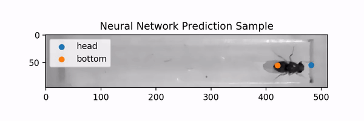

# Drosophila [Real-Time] Labelling w/ Deep Learning [Using Auxiliary Losses]
as a method for
## Investigating Genetic Manipulations As a Method to Rewire Moonwalker Neurons in Drosophila
### Miniproject for Controlling Behaviour in Animals and Robots course @ EPFL, Spring 2019
The course is taught by [Ramdya Lab](https://github.com/NeLy-EPFL).
#### Kaleem Corbin, Kiara Davis, Olesia Altunina
*DL processing and plots by Olesia, traditional image processing and most of the written text by Kaleem and Kiara.*
- `Report.pdf`: project objective, description of the setup and methods, and results.

# DL Processing Pipeline
## Prepare Data
### Label
- `create_dataset_template.py`: create the labeling template,
- `extract_keypoints.py`: extract the keypoints from the labeled COCO style dataset.

### Train
- `crop_imgs_train.py`: crop and filter labeled images,
- `prepare_train.py`: augment and split into stripes imgs and corresponding keypoints.

### Test
- `prepare_test.py`: crop, filter and split into stripes the test dataset.

## Train
- `model.py`: the neural net used for predictions,
- `train_split.py`: train model.

## Predict
- `predict_test.py`: make predictions using the trained model.

## Visualizations
### Predictions
- `view_keypoints_test.py`: create an animation from the test sample to illustrate predictions.

### Movement
- `count_backwards.py`: count backward and forward movements and no movement,
- `light_times.py`: get the frames when the light turns on to center the time series,
- `plot_traces.py`: plot movement traces,
- `plot_traces.py`: plot movement traces in one picture,
- `plot_boxplots.py`: plot boxplots with Backward / (Backward + Forward) distribution.

**NB:**
- `data/orig/` lacks `\*/\*/img_split_sorted.pt` files because they take up a lot of space (~10 GB). If you need them for test predictions, run `prepare_test.py`,
- `data/label` lacks `imgs_expanded_split.pt` file (~400 MB). To get it, run `prepare_train.py`.

## Other
### Traditional Image Processing
Data processing with the traditional image processing approach *(OpenCV)* is contained in the `ImageProcessingModel` folder.
It contains two files:
- `preprocessng.py`: generate the preprocessed image and detect the heading direction,
- `DeterminingDirection.ipynb`: This file contains the latest version of both methods for detecting direction (longest distance, split boxes).

### Resources and helper files
- `data.zip`: all originally recorded data as images
- `data_Videos.zip`: original data converted to video format
- `VideoGeneration.ipynb`: helper notebook to convert still frames into a video at 10 fps.
